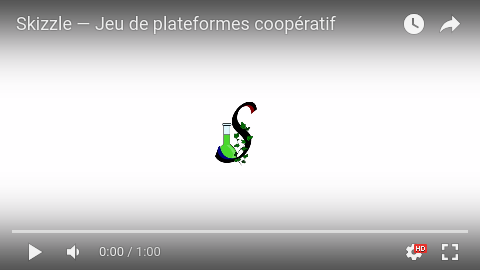

  

**Skizzle est un jeu inspiré des jeux de plateformes,** des jeux
de réflexion et de coopération. Deux joueurs font évoluer leur
balle à travers des niveaux en forme de courts casse-têtes. Ils
doivent parvenir jusqu'à la ligne d'arrivée en exploitant les
différents mécanismes physiques et objets particuliers qu'ils
peuvent rencontrer.

## Cadre

Le jeu a été développé dans le cadre du projet C.M.I. informatique
annuel pour l'Université de Montpellier. Vous pouvez lire
les différents rapports de suivi du projet dans le dossier
`docs/rapports/`.

## Installation et utilisation

Le jeu est compatible avec la plupart des systèmes d'exploitation
courants, notamment Windows, Mac OS X et Linux. Comme
le jeu n'est pas encore arrivé à une version stable, nous ne
fournissons pas de version précompilée.

Pour compiler manuellement le jeu, des instructions détaillées
sont disponibles.

* [Guide pour Linux.](docs/guides/compilation-linux.md)

## Licence

Tous droits réservés.
